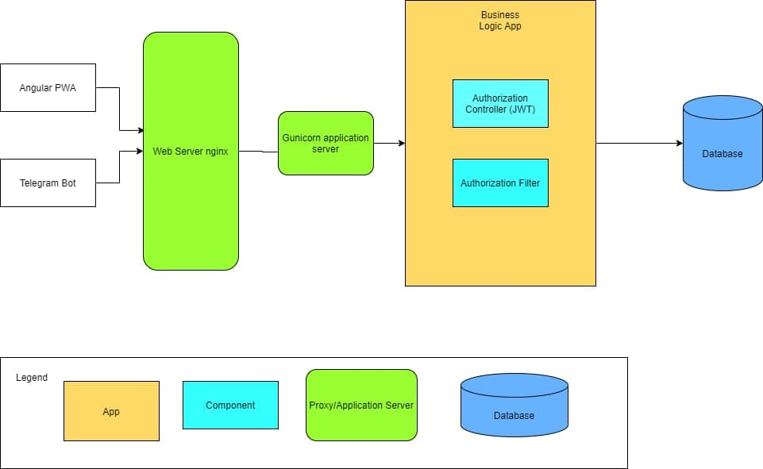
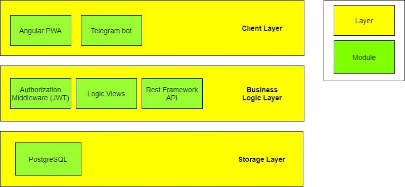
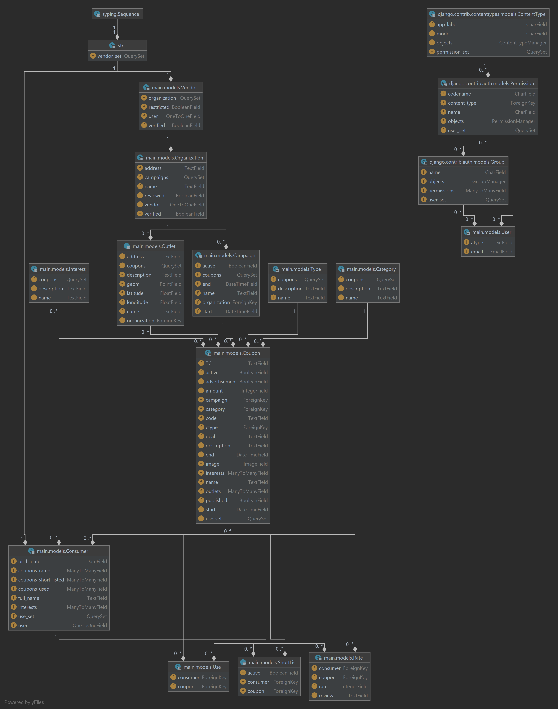

# CAT - **C**oupons **A**dvertisement **T**able

----

## What is this?

Coupon-sharing platform, where customers can find hot sales with coupons, while vendors can share their coupons and
monitors real time statistics of their campaigns.

## RUP arifacts

RUP artifacts document can be accessed via [this link](https://docs.google.com/document/d/1gP8MP3MpDAbje775VQPVcoORg-JKeUrckKbF0LiK6bM/edit#)

## Glossary

- **Vendor** - a person responsible for companies PR activities, able to create campaign
- **Customer** - a user of a service searching for coupons
- **Platform user** - Vendor or customer using the platform
- **Campaign** - a series of coupons related by theme, dates, categories.
- **Coupon** - a promocode user can activate to get a discount

## Dynamic view

 

## Static view

## Main features

### For customers

- Search coupons by tags, interests & organizations
- Alerts on hot offers

### For vendors

- Create advertisement campaigns & share with users
- Collect real-time stats on how good your campaign is taking place

## Technologies

- Python ❤ Django
- Django rest framework + JWT
- Nginx, Gunicorn
- Postgres with Postgis extensions
- Angular

## Authors

- Evgenii Panov @dreamer-tech
- Akbar Madaminov @akbarmadaminov
- Alexander Batyrgariev @sasha00123

## Beta Checklist

- [x] Base project structure

- [x] Email authentication + JWT authentication

- [x] API Coupon manipulations

- [x] Angular vendor dashboard

## Release checklist

- [ ] Client (Telegram, Mobile or Web) for searching coupons

## UML diagram

